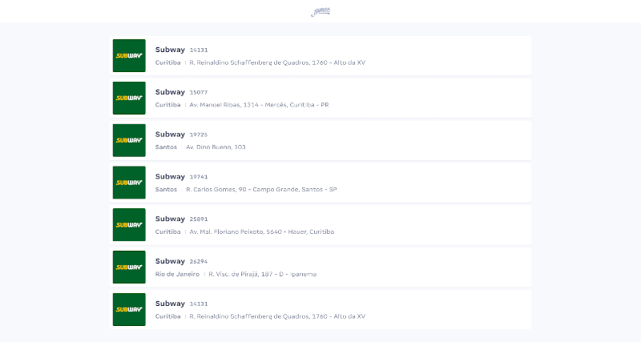

 

  

  <h3 align="center">Front-end Challenge :trophy:</h3>

  

    :suspect: How you solve problems? :godmode:
     
     
    <a href="https://www.jamesdelivery.com.br/talentos/">Talents</a>
    ·
    <a href="https://www.figma.com/file/6Z1eafamhmHr6n7DWbm4I9/Teste-James">All Figma Screenshots</a>
  

## Table of Contents
- [Challenge Description](#challenge-description)
  - [Goal](#goal)
  - [Non-functional specs](#non-functional-specs)
  - [User Stories](#user-stories)
      - [:lock: As a anonymous user](#lock-as-a-anonymous-user)
    - [Business Rules](#business-rules)
  - [Deliverables](#deliverables)
  - [Evaluation](#evaluation)
  - [Bonus Deliverable](#bonus-deliverable)

# Challenge Description

     
    
     
     
    <a href="https://www.figma.com/file/6Z1eafamhmHr6n7DWbm4I9/Teste-James">
        All Figma Screenshots »
    </a>
     

We want to understand you better, so do not be afraid of failing, this is not a right or wrong matter. Just do your best. Good luck! :smile:

## Goal

Your team is developing an application for users to manager establishments information. Your task is to create a Web application to consume and register this information.

## Non-functional specs

* You must be builded in Angular 10.
* You may use a css pre-processor.
* You may use any piece of technology you think is necessary or cool.
* It must be builded in *components*.
* Serviceless, you need to use the browser's technologies to save a persistent data. Use what you prefer. _Pure language_, libs, tools, you decide.
* It must be easy to setup and deploy. :children_crossing:
* Use any Fonts.
* Do your best.
* [Use this api](https://my-json-server.typicode.com/james-delivery/frontend-challenge)

## User Stories

#### :lock: As a anonymous user
* I want to see a list of establishments
* I want to see all information of a establishment
* I want to save a change of this establishment
* I want to go back to list of establishment

### Business Rules

* Information changed is saved local only.
* Always when user are opening application, all changed information need to be shown.
* Application start with a pre populated data. Places, images, comments and users.

## Deliverables

* The source code in a public git repository.
* Instructions how to run the development environment.
* Instructions how to deploy.

## Evaluation

The evaluation will follow the criteria below.

* :dart: Good practices.
* :wrench: Code maintainability.
* :rocket: Performance.
* :watch: Full operation.
* :factory: Robustness.
* :earth_americas: Scalability.

*Decision making and your reasons behind your choices...*

## Bonus Deliverable

Beyond your hard skills we are also interested on how you think, the way your code evolves and grows until it's done. So if you are feeling like a [awesome developer streamer](https://github.com/bnb/awesome-developer-streams) :blush: :tv:, we would like to see a video of your development process. It would allow us to better understand you and give you a more complete feedback.
